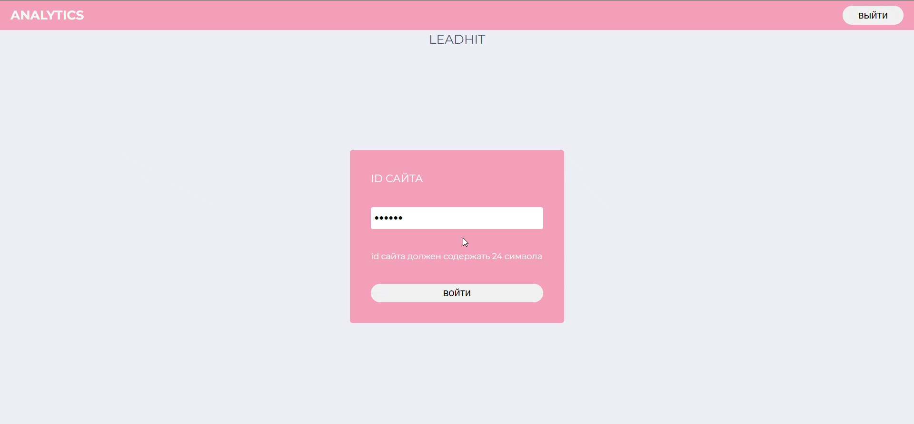

# Приложение Аналитика

<details>
  <summary>Задача</summary>

    Создать приложение с помощью Vue-CLI. В приложении должны использоваться библиотеки vue-router и vuex. С помощью vue-router создать две страницы:
    Страница “Авторизация”
    Страница “Аналитика”
    Все страницы необходимо оформить в одном стиле на ваш вкус. Для оформления можно использовать любые библиотеки.

    Страница “Авторизация”
    На странице “Авторизация” должны быть - заголовок с текстом “LeadHit” и форма. Форма должна содержать одно поле и кнопку. Поле необходимо для ввода “id сайта”. Кнопка должна содержать текст - “Войти”. При нажатии кнопки необходимо:
    Проверить, что длина значения, введенного в поле, равна 24 символам. Если значение не соответствует условию отображать ошибку с текстом: “id сайта должен содержать 24 символа”. Скрывать ошибку при вводе значения в поле.
    Если значение соответствует условию, делать HTTP запрос. Запрос можно реализовать через стандартные методы или подключив какую-либо библиотеку на ваш выбор. Запрос необходимо выполнить со следующими данными:
    URL - https://track-api.leadhit.io/client/test_auth
    метод - GET
    Headers:
    Api-Key: 5f8475902b0be670555f1bb3:eEZn8u05G3bzRpdL7RiHCvrYAYo
    Leadhit-Site-Id: 5f8475902b0be670555f1bb3
    Заголовок Leadhit-Site-Id необходимо брать из поля формы.
    В случае получения ответа "message": "ok", сохранять в localStorage ключ - ‘leadhit-site-id’, со значением - ‘5f8475902b0be670555f1bb3’, после чего перенаправлять пользователя на страницу “Аналитика”.

    Страница “Аналитика”
    На странице “Аналитика” необходимо отобразить:
    заголовок страницы - “Аналитика”;
    заголовок графика - “Аналитика по визитам”;
    график визитов;
    График должен состоять из двух осей:
    на оси x должно отображаться время (данные для этой оси должны быть взяты из ключа “date” объектов массива, приведенного ниже);
    на оси y должны отображаться визиты (данные для этой оси должны быть взяты из ключа “visits” объектов массива, приведенного ниже);
    Пример отображения графика:

    При наведении на точки пересечения осей желательно отображать дату и количество визитов конкретно для этой точки. Для отображения графика использовать бибилиотеку https://www.amcharts.com/

    Данные для отображения на графике:
    [
    {"date":"2020-07-01","visits":213},
    {"date":"2020-07-02","visits":249},
    {"date":"2020-07-03","visits":179},
    {"date":"2020-07-04","visits":170},
    {"date":"2020-07-05","visits":184},
    {"date":"2020-07-06","visits":202},
    {"date":"2020-07-07","visits":198},
    {"date":"2020-07-08","visits":168},
    {"date":"2020-07-09","visits":176},
    {"date":"2020-07-10","visits":171},
    {"date":"2020-07-11","visits":190},
    {"date":"2020-07-12","visits":154},
    {"date":"2020-07-13","visits":246},
    {"date":"2020-07-14","visits":250},
    {"date":"2020-07-15","visits":227},
    {"date":"2020-07-16","visits":140},
    {"date":"2020-07-17","visits":170},
    {"date":"2020-07-18","visits":125},
    {"date":"2020-07-19","visits":106},
    {"date":"2020-07-20","visits":207},
    {"date":"2020-07-21","visits":222},
    {"date":"2020-07-22","visits":198},
    {"date":"2020-07-23","visits":204},
    {"date":"2020-07-24","visits":213},
    {"date":"2020-07-25","visits":145},
    {"date":"2020-07-26","visits":166},
    {"date":"2020-07-27","visits":163},
    {"date":"2020-07-28","visits":135},
    {"date":"2020-07-29","visits":45}
    ]

    При переходе на страницу “Аналитика” по ссылке, отслеживать наличие в localStorage ключа - ‘leadhit-site-id’, и в случае его отсутствия перенаправлять пользователя на страницу “Авторизация”.

</details>

<div align="left">




## Проект сожержит

<details >
  <summary >Vue</summary>

  [Что это?](https://vuejs.org/)

    Прогрессивный JavaScript-фреймворк

</details>
<details >
  <summary >VueX</summary>
 
  [Что это?](https://vuex.vuejs.org/) 
 
    Централизованное хранилище данных для всех компонентов приложения.
    Входной точкой является файл store/index.js
</details>


<details >
  <summary > Vue router</summary>
 
  [Что это?](https://router.vuejs.org/) 

    Роутиг на страницах осуществляется через [<router-view>] без перезагрузки
    шапка сайта остается неизменной
</details>

<details >
  <summary >Yup</summary>
 
  [Что это?](https://www.npmjs.com/package/yup) 

    Yup — это конструктор схемы JavaScript для анализа и проверки значений.
</details>

<details >
  <summary >Vee-validate</summary>
 
  [Что это?](https://vee-validate.logaretm.com/v4/) 

    Form Validation for Vue.js
</details>

<details>
  <summary>Scss</summary>
 
  [Что это?](https://sass-scss.ru/)  

    Конфигурации нужно изменять в файлах root_light.scss root_dark.scss   для разных цветовых тем.
  
  Для  автоматического комполирования файлов css необходимо запустить  
  Live Sass Compiler: 
   [Что это?](https://marketplace.visualstudio.com/items?itemName=ritwickdey.live-sass)  


</details>

<details>
  <summary>Локальный сервер</summary>
 
  [Что это?](https://ru.wikipedia.org/wiki/Localhost) 
 
  По умолчанию [localhost:8080](http://localhost:8080).
</details>


# 
## Для запуска потребуется
- этот репозиторий 
 ```
git clone https://github.com/VladislavBobyrev/analytics-vue
```
- node.js 
 
```
https://nodejs.org/en/
```

- Live Sass Compiler

 
```
https://marketplace.visualstudio.com/items?itemName=ritwickdey.live-sass
```

- браузер

#
## Команды

|                        |                       |
|------------------------|:----------------------|
| Установить зависимости | `npm i`               |
| Запустить локально     | `npm run serve`       |
| Собрать                | `npm run build`       |
| Запустить линтинг      | `npm run lint`       |
 
#
## Связвться со мной
<div align='center'> 
 
 ```
vladislavbobyrev@yandex.ru
```
 
 [](https://t.me/VladislavBobyrev)

 </div>
 
<div align="center">
  <h2>**ВНИМАНИЕ!**  Вся конфигурация является открытой. </h2>
 
**ВНИМАНИЕ!** На компьютере должны быть установлены программы `node` и `npm`.
Генерация  занимает много времени за счёт
установки `node_modules`. Необходимо дождаться окончания этого процесса.
 
</div>


